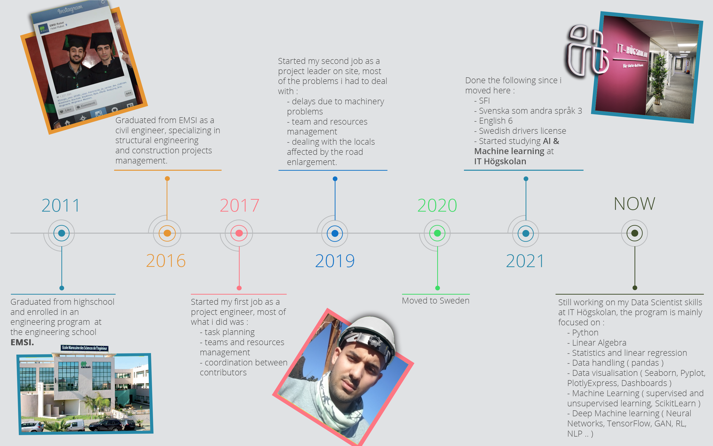

# Sami Fatmi :computer:

I am a civil engineering graduate who has developed a love for AI and machine learning. I had the chance to study programming while studying civil engineering and I sort of fell in love with programming, i liked the idea of automating things using programs and I tried to make either simple programs in C or Excel Sheets to automate some of my civil engineering calculations for structures. I started learning more about AI once i moved to Sweden in 2020 and found a perfect mixture of what I already am and what I would love to become : Data Science.

Data science is a mixture of mathematics, statistics and analysis which I am already pretty comfortable with from my civil engineering studies and experience, and programming which i have always loved to do. I therefore followed my passion and interests to become a data scientist, and I am excited to use my skills to make a difference in the world. My background in civil engineering has given me strong analytical skills and an understanding of how systems work, which I can apply to solving complex problems. 

Concerning my hobbies, I am a horse rider and horse trainer. Since i moved to Sweden I also started fishing. I hang out pretty often with friends, and when I am not outside I am on my computer learning something new or working on some AI!

I am looking for a new challenge where I can continue to learn and grow, and make a real impact on the world.
